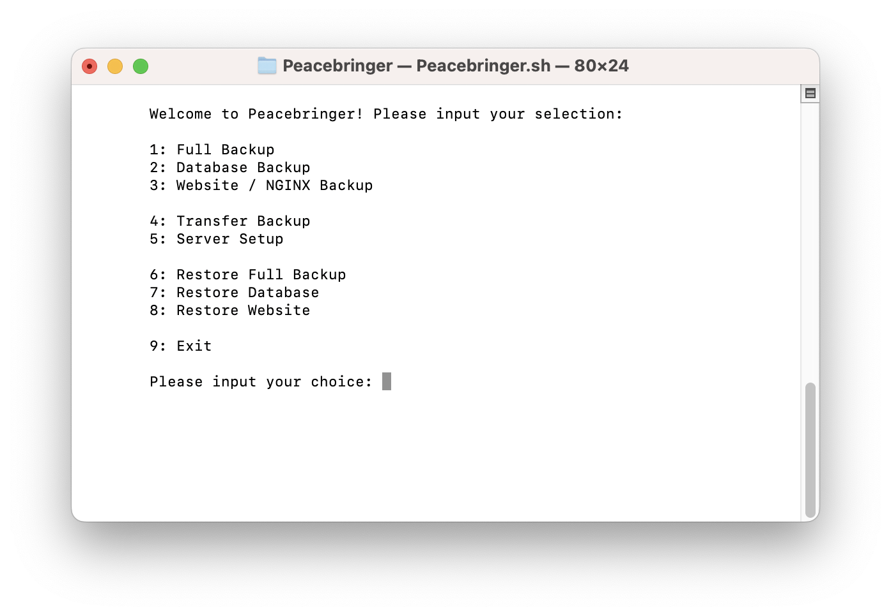

Peacebringer is a program I created to help automate server backup, transfer, and restoration.

The purpose of this is to achieve rapid response times for whenever my friend and I were constantly upgrading servers. This helped us out enourmously, and cut down installation times by a tremendous amount.

If you know basic Bash, this can easily be modified to suit whatever needs you have to tailor it to. If you would prefer my Python3 variant of this, please check out Warshade.

